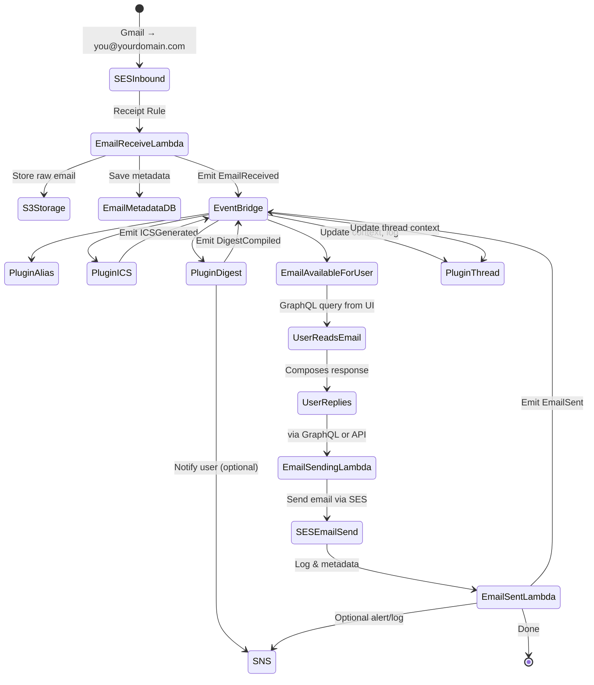

Octomate Architecture Overview
==============================
> Version: 2025-05-06

### Principals:
- Loosely coupled compoents via an Event Log (Event Bridge)
- pay-for-usage only (not for time
- Modular – each plugin stands alone
- Observable – pluginMgr can track partial or failed execution
- User-centric – failure is surfaced but doesn’t cause cascading failure
- Open-core friendly – easily supports user-installed plugins of varying reliability

#### Events Lifecycle

[link for event lifecycle][mermaidLiveEventLifecycle]

1. RawEmailReceived (next: processing)
2. RawEmailPreprocessing (next: indexed/stored)
    (may have sub events generated from plugin processors)
3. EmailReceived (next: indexed/stored)
4. EmailState

#### Event Topics:
| Event Name   | Type   | Source  | Where It Lives   | Used By   |
|--------------------|--------|---------|------------------|-----------|
| `EmailReceived` | EventBridge | `email-receive` Lambda | Emitted on `EmailEventBus` | Triggers plugin chain   |
| `EmailSent` | EventBridge | Outbound handler Lambda | `EmailEventBus` | Archival, stats, tracking  |
| `PluginExecutionStart`  | EventBridge  | PluginManager     | `EmailEventBus`         | Monitoring, audit              |
| `PluginExecutionSuccess`| EventBridge  | PluginManager     | `EmailEventBus`         | Metrics, logging               |
| `PluginExecutionFailure`| EventBridge + SNS | PluginManager | `EmailEventBus` → SNS topic | Triggers alerts, retry logic   |
| `AliasMatch`       | EventBridge  | Alias Plugin     | `EmailEventBus`            | Routing audit                  |
| `ListserveMessage` | EventBridge  | Listserve Plugin | `EmailEventBus`            | Fan-out/traceability           |
| `DigestCompiled`   | EventBridge → SNS | Digest Plugin  | EventBridge, then SNS if user subscribed | Notify user                   |
| `ICSGenerated`     | EventBridge  | ICS Plugin       | EventBridge                | Logs, tracking, optional SNS   |
| `WebhookDeliveryError`| EventBridge + SNS | Webhook Plugin | Both                      | Alert on failed delivery       |

### Requirements:
- 

### Use Cases:
- 

### Current Solution Diagram:
[link to live view][mermaidLiveView]

```mermaid
graph TD

%% User Interfaces
subgraph "User Interfaces"
    UI["Web Email Interface (React/Next.js)"]
    Client["SMTP/IMAP Email Clients"]
    Admin["Admin Dashboard"]
    PluginUI["Plugin Settings & Preview Panels"]
end

%% API Layer
subgraph "API Layer"
    GraphQL["GraphQL API Gateway (AppSync)"]
end

%% Lambda Layer
subgraph "Core Lambda Functions"
    EmailRecv["Lambda - Handle Incoming Email"]
    EmailSend["Lambda - Send Email via SES"]
    SearchLambda["Lambda - Index Email for Search"]
    NotesLambda["Lambda - Thread Notes, Aliases"]
    PluginMgr["Lambda - Plugin Orchestrator"]
end

%% Plugin Subsystem
subgraph "Plugin Framework"
    EventBus["EventBridge - Email Lifecycle Events"]
    PluginRegistry["DynamoDB - Plugin Metadata & User Config"]
    PluginAlias["Plugin - Alias Forwarding"]
    PluginListserve["Plugin - Group/Listserve"]
    PluginRSS["Plugin - Email-to-RSS"]
    PluginAutoReply["Plugin - Auto-Responder"]
    PluginLabeler["Plugin - Smart Labeler"]
    PluginWebhook["Plugin - Webhook Forwarder"]
    PluginDigest["Plugin - Email Digest"]
    PluginICS["Plugin - ICS Attachment Generator"]
end

%% Data Services
subgraph "Data Services"
    DDB["DynamoDB - Email Metadata, Threads"]
    S3["S3 - Raw Email Storage"]
    OpenSearch["Amazon OpenSearch - Full Text Indexing"]
    SES["Amazon SES - Email Send/Receive"]
    SNS["SNS - Spam Notifications & Alerts"]
end

%% DNS / Identity
subgraph "Domain Integration"
    Route53["Route53 - BYOD DNS Routing"]
    ACM["ACM - TLS Certs for Domains"]
end

%% Admin Tools
subgraph "Admin / CloudOps"
    CFN["CloudFormation Template"]
    Cognito["Cognito - Auth (OAuth, SSO)"]
    WAF["Web Application Firewall"]
end

%% Connections
UI -->|GraphQL| GraphQL
Admin -->|GraphQL| GraphQL
PluginUI -->|GraphQL| GraphQL
Client --> SES
Client --> SES
GraphQL --> EmailRecv
GraphQL --> EmailSend
GraphQL --> NotesLambda
GraphQL --> SearchLambda
GraphQL --> PluginMgr

EmailRecv --> SES
EmailRecv --> S3
EmailRecv --> DDB
EmailRecv --> OpenSearch
EmailRecv --> EventBus

EmailSend --> SES
EmailSend --> EventBus
NotesLambda --> DDB
SearchLambda --> OpenSearch

EventBus --> PluginMgr
PluginMgr --> PluginRegistry
PluginMgr --> PluginAlias
PluginMgr --> PluginListserve
PluginMgr --> PluginRSS
PluginMgr --> PluginAutoReply
PluginMgr --> PluginLabeler
PluginMgr --> PluginWebhook
PluginMgr --> PluginDigest
PluginMgr --> PluginICS

Route53 --> SES
Route53 --> ACM
CFN --> Route53
CFN --> Cognito
CFN --> GraphQL
CFN --> SES
CFN --> DDB
CFN --> OpenSearch
CFN --> S3
CFN --> UI
CFN --> WAF

```

Current Solution Notes:
- 

[mermaidLiveView]: https://mermaid.live/edit#pako:eNp1Vltv2kgU_isjS12lEoRAEpLwsBKBkkWCwOJE1bbsw2AfzGztGWs8TkLT_Pc9c_EFQ_OQeM79-p28e4EIwRt4kaTpjjyN13zNP30izxlIMuUK5JYGkK15lm-syNpr8rw1J_jzPP2-9r7ChnxJKIsrAXK2AhqoziO8qfP_ss9r71-rMIoZcIVK_vxp2ZnOh0unahlZKTgME8ZRzvwlY5rtNoLKsOQv4zxi3Pi3n8QHpRiPMvIHWUp4YfBKlpRDbG0CD12aw-WUzOge5EGCFdWl9qAZf8_Qvvsyig9UwSvdk7Nhmvp7HnxuGJ_RZBPSE_ZHQkLBneQ8UEzwsoymBCsIXtCbk2mTvygPY8CaBgJLEFmhMn_z8tFxXUW_XT1fGCX-F7-U94HKYGcl6ypTHsKb09kK6eRKtUehIDvWetpJoKHltsgwZjSDrNGbeSTrKq5LC7QOmZJUCdmoXdHHfJPtMwXJQf0ccyJpAq9C_ihL94Jjc59n6Mp-ShZGgP5sSjO2hWAfYB0NtxnjCiKGwexRe7znNBHj-yrUOSgaUkVxoMz4jwTfsqhhweReDWHbFoNMhHzFccW-NeRn6A-NvUBd50GKPO2UrGaQvl8XNom1lWgjvRlMrsQK0nh_EFCuZSFLBbZaNsOhG4hB1uX9hEpFHKMhjqu-E-JHXdyRioyPVMYswn4fJUAsvSE8HR2kik8yVIoGuwSbRx6Aw6nBGesm-Vg51oStQ44bmfH4_rDfNqCi3S033dWs-JcasC5RckVfnbSPYdCoatUiBW53R4NWQn8KXqOh6iSPY_KEeGhXrj4ZuKeVEj7KkPQ-dxAXgNWGwn_U0vhb9yqlid5CtmUBNZCCwzrEvqkm6o1RvkOmIdaRqf1hkQQ64wa8kaStFJVaiVzBtc7efaHL-38WY2NNk-pZDEdzncVorvFh5pORjsJginVwhMMG2Z-EiA97ZukdvAgiDxdp2bbR5BHtGyrOWmICxYImaYyYXB0YEXGmhJa0X3YDduRsof-0iO8vqnP0dThxBwzxPHY1JBMmEeTjuBEw7j8HB9x4eUi7_ecvdxt-FedizW34p3nF0foN295AzTTQffQuDpEmlCfjBNk3MdfJNRg_ZNTPwiGnBHGdfemtCqZBumxScMuapGofmpwCxUtf5pId-ipJlXAtrcpnPaUjt2jLaTeTLD9rjOI8nOYapD_NqqD8tF1E7tMmCwD_jVkHyieZDohPMx3anuQhyurClCteVL1OwLXGeZw8modjVAS3ahWhGmlHsPPsHqZNxaPenVK6Zvt5Wn3juq6518J_XFnoDZTMoeUlgFign9673um1p3aQIB4M8DOk9h-FD9RJKf8mRFKo4cWNdt5gS-MMX3mKyA9jRhGEKhHQB3Mkcq68Qa_f7Rsj3uDde_MG7Zub8-5V77Z_cdXtXd_d9JG712IX53f9u9ur2_5l7xY5Hy3vp3HbPb_o3l5fXXS7F_1e_6p33f_4H1mv0Ks

[mermaidLiveEventLifecycle]:https://mermaid.live/edit#pako:eNp9lN9v2jAQx_8Vyw_TNgEj4UdoHqa1wKpKtOtIedmyB0OOYMmxM8dJyxCv-wP2J-4v2TmhWVoBSMDd-fu5s8-X7OhKRUB9mhlmYMJZrFnSLtxQEvx8f_-DtNsfSTANbuRS5TIiPrlOGBfk7-8_ZKvyT_jVkcKQ7KxUUmENuaWnFpjDCngBM5YsI4ZZSj81ZJ4LqKgjsrJ2LzBKsxgQshYQzR4JWPFZrgzfgmERM2xyZWlWAEkOkfNsAdJcaR6VVacJNy-UUSgPeENnuXuRx1xeCs6yc4KbcXBuecJjyEylqIFT-8Kla5Cg8faiJlIlOUVVq2OVpFyc5IK7APV3yvD1luQZaPJWpYYrycS7Ux0o23RZ4A9bCvis9AK5Rq9fL5WQNebAoqyU2BHTLN18nZGfOegtWWuVkMVNleWV9j-eCg4ZsvZQKkNTQ5YqmcHzVpuyw1CXOQIox9r-ZaTgjAS3D_dE6brkC2F9SPRMPc0zFZM3x2aroTo3WFZ2biQeNhrPjMgixQJATOWvlDTwZE7Xq67wy-HWCBOgzQeh4vr6jjD2offJREnsHG3RGPdCfaNzaNEENALo0p3lQ2o2kEBIfTQjWLNcmJCGco9YyuQ3pZJnUqs83lB_zUSGXl6e4vC2qaMa-wt6jO8NQ_2B45RJqL-jT9RvO8NOz7kYDgcX3dHI6fU9r0W3Nt53O07Xcwf9rjvqud3evkV_lYWdjuN63sDtDvuO53lo7_8BHYGaXg