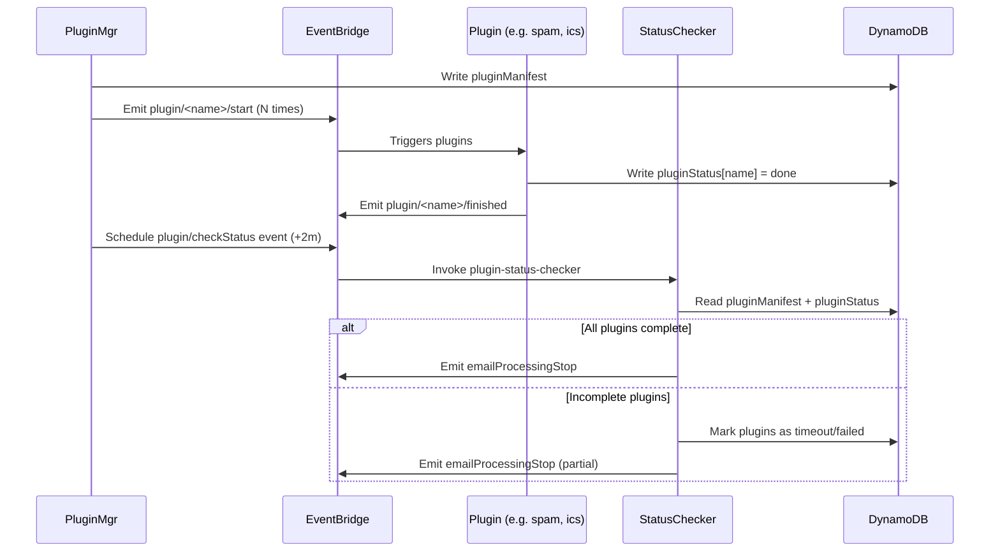

See Plugins for more detail on architectural choice

```mermaid
sequenceDiagram
    participant PluginMgr
    participant EventBridge
    participant PluginLambda as Plugin (e.g. spam, ics)
    participant StatusChecker
    participant DynamoDB

    PluginMgr->>DynamoDB: Write pluginManifest
    PluginMgr->>EventBridge: Emit plugin/<name>/start (N times)
    EventBridge->>PluginLambda: Triggers plugins
    PluginLambda->>DynamoDB: Write pluginStatus[name] = done
    PluginLambda->>EventBridge: Emit plugin/<name>/finished

    PluginMgr->>EventBridge: Schedule plugin/checkStatus event (+2m)
    EventBridge->>StatusChecker: Invoke plugin-status-checker
    StatusChecker->>DynamoDB: Read pluginManifest + pluginStatus
    alt All plugins complete
        StatusChecker->>EventBridge: Emit emailProcessingStop
    else Incomplete plugins
        StatusChecker->>DynamoDB: Mark plugins as timeout/failed
        StatusChecker->>EventBridge: Emit emailProcessingStop (partial)
    end

```
