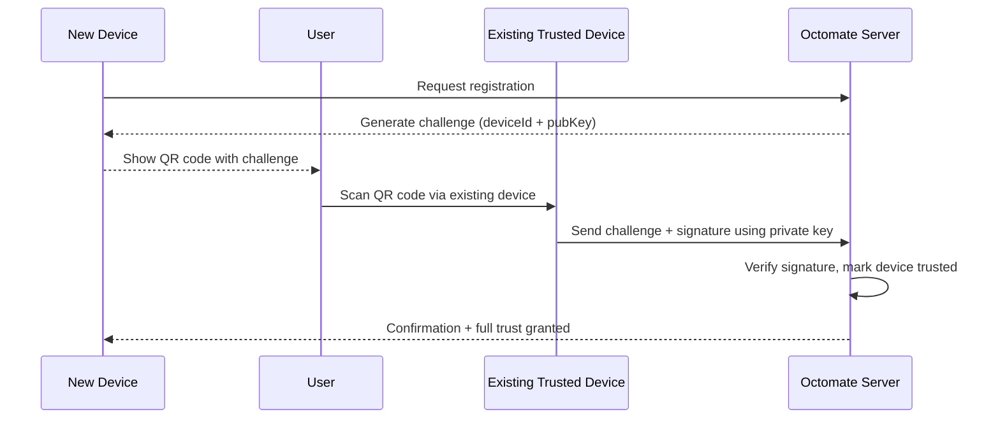

Example of Authoring partially encrypted content
=================================================

## Default

```encrypted
API Key: abc-123
```
_and_

```encrypt
API Key: abc-123
```

## Stated Fallback
```encrypt fallback="remove | link | inline"
API Key: abc-123
```

might also be used composed with

```text

```expires 14days
```encrypt
some interesting secret that will self-destruct 
\```
\```

```


```text
```encrypt
```expires 14days
some interesting secret that will self-destruct 
\```
\```
```


Invisible Header
Sidecar Attachment
Visible Footer


🔐 Plugin Responsibilities: Encryption + Fallback
✅ 1. Sidecar Key Exchange

- Include public key metadata for recipients
- Use MIME attachments or footer block for clients
- Optional: initiate key sync for first-time contacts

✅ 2. Authorization for Fallback Access

- If the recipient isn't using an Octomate client (or decryption fails), the plugin routes them to a fallback verification UI.

Strategies:
a) 🔑 Passive Session Validation

If recipient has an Octomate login session: show content
Else, show auth/login prompt

b) 📬 Contact Form Challenge (Sender-defined)

Allow sender to define a “proof of familiarity” question:
“What’s my home street name?”
Answers are hashed and stored alongside the snippet
Recipient must pass the challenge to decrypt fallback
Allows friend/family use without requiring accounts

c) 🧠 Optional AI-derived “familiarity heuristics”
Long-term: use contact history, writing style, known metadata to weight confidence — but that’s out of MVP scope.

✅ 3. Policy-Driven Access Controls

Each snippet can carry:
```json
{
  "snippetId": "abc123",
  "expiresAt": "2025-06-01",
  "viewOnce": true,
  "authorizedGroup": ["eric@example.com", "family"],
  "fallbackChallenge": {
    "question": "What’s our old street name?",
    "answerHash": "<bcrypt>"
  }
}
```

🔄 Workflow Summary
Step	Action
📝 Author writes fenced content	
🔐 Plugin encrypts, attaches metadata + keys	
📤 Sends email w/ markdown + fallback link	
📬 Recipient opens email
✅ If Octomate client: decrypts seamlessly	
🔄 If not: redirect to `/decrypt?id=abc123`
👤 If not logged in: prompt login or fallback challenge	
🔓 On success: content revealed, optionally watermarked	

🔐 Expanded Fallback Authorization Modes
✅ Tier 1: Knowledge-Based Challenge (KBA)

✔️ "What is our shared memory?" (street name, pet, etc.)
✔️ Hash of answer stored
❌ Low assurance (guessable)

✅ Tier 2: Secure Auth Layers (Optional / Configurable)
| Method             | 	Security    | UX Friction | Notes       | 
|--------------------|--------------|-------------|-------------|
| SMS OTP            | Medium       | Low–Med	  | Fast to implement via AWS SNS or Twilio | 
| TOTP (Time-Based)	 | High    | Med | Use Google Authenticator, 1Password, etc. (RFC 6238) | 
| Email Magic Link	 | Medium       | Low	      | Best for logged-in-but-cold users | 
| Passkey / WebAuthn | 	Very High   | Low (after setup)	| No password, phishing-resistant | 


🧱 Recommended Design

🔐 1. Snippet Metadata Schema (extended)

```json
{
  "fallbackAuth": {
    "type": "TOTP",
    "totpSecret": "<base32...>",
    "retriesAllowed": 3
  },
  "expiresAt": "2025-12-01T00:00:00Z",
  "viewOnce": true
}

```

Or for passkey:

```json
{
  "fallbackAuth": {
    "type": "WebAuthn",
    "credentialId": "...",
    "challenge": "..."
  }
}
```


🔄 Dynamic Fallback Flow

```text
Email → [Markdown fallback link]
           ↳ hits: /decrypt?id=abc123
                      ↳ checks policy
                          ↳ if fallbackAuth exists:
                              show custom verification UX
                          ↳ on success:
                              log access
                              return plaintext

```

Each fallback mode could be modular:

🧩 Injected as separate Lambda plugin

📦 Packaged as Octomate plugin (e.g., octomate-auth-totp)

🔐 UX Suggestion (Multi-layered)

👤 Who are you?
📱 Verify via:
  - [ ] Logging in
  - [ ] Shared answer -> Registration
  - [ ] SMS -> Registration
  - [ ] Email Link
  Login:
  - [ ] Passkey/Security key
  - [ ] TOTP / Authenticator apps
  

Let the user choose their path if multiple are enabled.
✨ Summary

This turns encrypted snippets into access-gated content blocks, where authorization policies are:

- Set per snippet
- Enforced by the decryption service
- Modular enough to grow from KBA to passkeys


