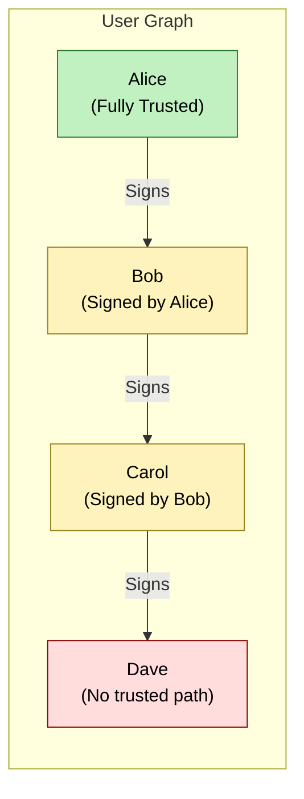

Calculating a Trust Score
=========================

Single Player Mode
----------------------

- Domain + Individual Behaviors
- Domains help bot strap unknown senders

- Email Platforms vs Companies
- Companies are Scored as an entity just like people
- Email Platforms convey very little by way of trust

Paradigm Shift
----------------------
Share my TrustGraph with my < Circle of Trust > This enables a NEW Chain of Trust Mode
----------------------

Chain of Trust Mode

Trust Score = introducer.trustLevel * decay(hops);

There are other things called - `endorsements` where there 

To bootstrap trust using these sidecar artifacts:
- Extract the payload (from headers, mime, or footer)
- Parse and cache sender's public key
- Check for endorsements (e.g., signedBy someone I trust)
- Build or reinforce trust edges in the TrustGraph

